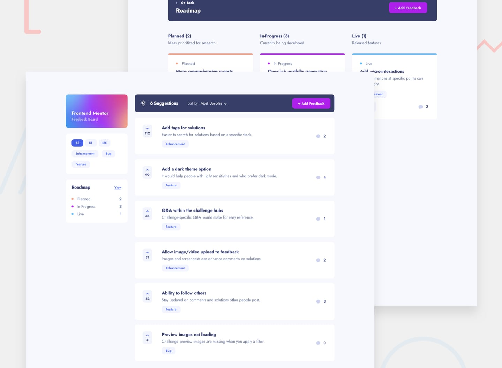

# Frontend Mentor - Product feedback app solution

This is a solution to the [Product feedback app challenge on Frontend Mentor](https://www.frontendmentor.io/challenges/product-feedback-app-wbvUYqjR6). Frontend Mentor challenges help you improve your coding skills by building realistic projects.

## Table of contents

- [Frontend Mentor - Product feedback app solution](#frontend-mentor---product-feedback-app-solution)
  - [Table of contents](#table-of-contents)
  - [Development server](#development-server)
  - [Overview](#overview)
    - [The challenge](#the-challenge)
    - [Screenshot](#screenshot)
    - [Links](#links)
  - [My process](#my-process)
    - [Built with](#built-with)
    - [Features](#features)
    - [What I learned](#what-i-learned)
    - [Continued development](#continued-development)
  - [Author](#author)

## Development server

To start a local development server, run:

```bash
npm install

ng serve

```

Once the server is running, open your browser and navigate to `http://localhost:4200/`. The application will automatically reload whenever you modify any of the source files.

## Overview

### The challenge

Users should be able to:

- View the optimal layout for the app depending on their device's screen size - SOLVED
- See hover states for all interactive elements on the page - SOLVED
- Create, read, update, and delete product feedback requests - SOLVED
- Receive form validations when trying to create/edit feedback requests - SOLVED
- Sort suggestions by most/least upvotes and most/least comments - SOLVED
- Filter suggestions by category - SOLVED
- Add comments and replies to a product feedback request - SOLVED(but buggy, because it's need to change the mock datastructure)
- Upvote product feedback requests - NOT SOLVED
- **Bonus**: Keep track of any changes, even after refreshing the browser (`localStorage` could be used for this if you're not building out a full-stack app) - NOT SOLVED

### Screenshot



### Links

- Solution URL: [Add solution URL here](https://github.com/nemeth-laszlo-code/product-feedback-app)
- Live Site URL: [https://product-feedback-app-lemon.vercel.app](https://product-feedback-app-lemon.vercel.app)

## My process

### Built with

- Semantic HTML5 markup
- CSS custom properties
- TailwindCSS
- Flexbox
- CSS Grid
- Mobile-first workflow
- [Angular](https://angular.dev/) - Angular framework

### Features

- Responsive layout (mobile-first)
- Signal Store, Services
- Feedback CRUD (create, read, update, delete)
- Filter by category
- Sort by upvotes / comments

### What I learned

- Using Signal Stores for state management
- Creating reusable components compatible with Reactive Forms

```html
<h1>Some TS code I'm proud of</h1>
```

```ts
  // ---- Private state ----
  private requests = signal<ProductRequest[]>([]);
  private currentUser = signal<User | null>(null);

  // ---- UI state ----
  selectedCategory = signal<Category | 'all'>('all');
  selectedRequestId = signal<number | null>(null);
  sortBy = signal<SortOption>('most-upvotes');

  // ---- Computed ----
  filteredRequests = computed(() => {
    const category = this.selectedCategory();
    const all = this.requests();

    const filtered = category === 'all' ? all : all.filter((r) => r.category === category);

    return this.sort(filtered);
  });

  suggestions = computed(() => this.filteredRequests().filter((r) => r.status === 'suggestion'));

  categories = signal<string[]>([]);

  selectedRequest = computed(
    () => this.requests().find((r) => r.id === this.selectedRequestId()) ?? null,
  );

  // Roadmap
  roadmap = computed(() => {
    const all = this.requests();
    return {
      planned: {
        title: 'Planned',
        count: all.filter((r) => r.status === 'planned').length,
      },
      inProgress: {
        title: 'In-Progress',
        count: all.filter((r) => r.status === 'in-progress').length,
      },
      live: {
        title: 'Live',
        count: all.filter((r) => r.status === 'live').length,
      },
    };
  });

  roadmapItems = computed(() => ({
    planned: this.requests().filter((r) => r.status === 'planned'),
    inProgress: this.requests().filter((r) => r.status === 'in-progress'),
    live: this.requests().filter((r) => r.status === 'live'),
  }));

;
```

### Continued development

- Improve the commenting system (currently not working as expected)
- Add subtle animations to enhance the UI

## Author

- Website - [Laszlo Nemeth](https://jrgenhu-portfolio.vercel.app/)
- Frontend Mentor - [@nemeth-laszlo-code](https://www.frontendmentor.io/profile/nemeth-laszlo-code)
- Twitter - [@nemeth-laszlo-code](https://www.x.com/nemeth-laszlo-code)
